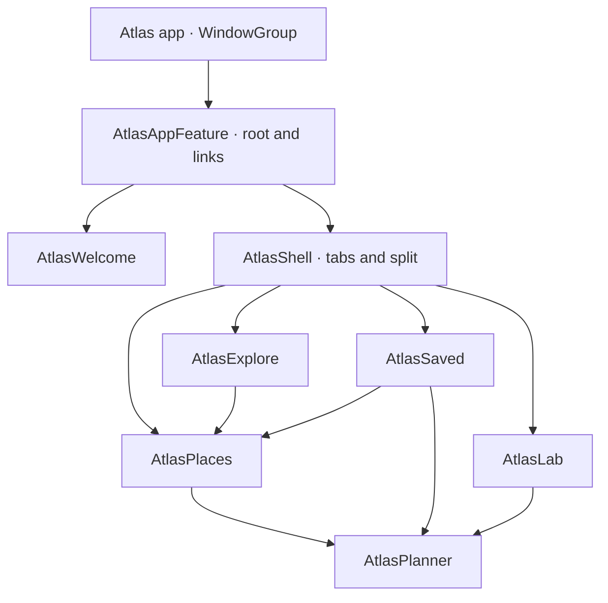

# Atlas

A small, offline travel app that demonstrates Scaffolding across **ten separate Swift packages**. Every feature and shared module owns its package manifest, library product, source directory, and explicit dependencies. Discover a place, save it, and create a journey through an independently owned planning flow. Open the Lab to explore the navigation behind the app.

<p align="center">
  <picture>
    <source media="(prefers-reduced-motion: reduce)" srcset="../../Sources/Scaffolding/Scaffolding.docc/Resources/atlas-tab-history-poster.png">
    
  </picture>
  <picture>
    <source media="(prefers-reduced-motion: reduce)" srcset="../../Sources/Scaffolding/Scaffolding.docc/Resources/atlas-planner-result-poster.png">
    
  </picture>
</p>

Real **iPhone 17 simulator / iOS 26.4** recordings: tab history (16 seconds) and
a Planner result (18 seconds), at original speed.
Pause/replay players: [tab history](https://dotaeva.github.io/scaffolding/documentation/scaffolding/tabbars) · [Planner result](https://dotaeva.github.io/scaffolding/documentation/scaffolding/modalsandresults) ·
[Recording steps and still images](Recordings/README.md) ·
[Saved journeys](Screenshots/iphone-saved.png) · [Dark appearance](Screenshots/iphone-dark.png)

**Start here:** [Run](#run) · [Tour](#a-five-minute-tour) ·
[Module boundaries](#module-boundaries) · [Code to read](#code-to-read) ·
[Checkpoint scope](#checkpoint-scope)


## Run

Open `Atlas.xcodeproj`, choose **Atlas**, and run on an iPhone, iPad, or My Mac. Requires Xcode 26 or later; deployment targets are iOS 18 and macOS 15. The app uses the Scaffolding checkout two directories above this demo.

```sh
open Example/Atlas/Atlas.xcodeproj
```

`Atlas.xcodeproj` is maintained directly in Xcode and checked in. It references the local packages under `Packages/` and links the `AtlasAppFeature` product. Change app targets, signing, and schemes in Xcode; change package dependencies in each package's `Package.swift`.

## A five-minute tour

1. **Start exploring.** Welcome hands control to a new root. iPhone starts with tabs; iPad and Mac start with three columns.
2. **Open the Dolomites.** Discover enters the Places module. Bookmark it with the toolbar button.
3. **Plan a few days here.** Planner opens as a sheet, pushes a review screen, and returns a `TripPlan` to Places. The completion message opens the exact saved journey. Canceling produces no result.
4. **Open Saved.** Switch between Places and Journeys. Reopen a journey, edit its duration or pace, or remove it with Undo. Re-tap a selected native tab to return its independent flow to the root.
5. **Open the Lab.** Push a chapter, inspect the legacy replacement demo, try a distinct route, await a choice, or present Planner full screen. Inspect the live coordinator tree in its own form section.
6. **Open a deep link.** The sample link switches to Lofoten’s field notes through typed coordinator handles. It also works from the welcome screen.
7. **Save a checkpoint in the Lab.** Explore elsewhere, change bookmarks, or switch layouts, then restore the checkpoint. It restores selected tabs or columns and inactive flow histories while preserving your latest saved content. The last explicit checkpoint is also restored when SwiftUI restores that window’s scene storage.

Switch between tabs and split view from the Lab. This deliberately creates a fresh shell while preserving saved content. In the compact split layout, use the native back controls to move between columns.

## Module boundaries



All features depend on the `AtlasDomain` package for models and capability protocols, and `AtlasDesign` for reusable visual components. `AtlasDomain` imports Foundation and Observation and has no SwiftUI or Scaffolding dependency. Each manifest declares local package dependencies and consumes named products with `.product(name:package:)`.

Every library follows the same layout, for example:

```text
Packages/AtlasPlanner/
├── Package.swift
└── Sources/AtlasPlanner/
    ├── PlannerCoordinator.swift
    └── PlannerScreens.swift
```

Open any package's `Package.swift` directly in Xcode, or build it independently with `swift build --package-path Example/Atlas/Packages/AtlasPlanner`. Dependencies resolve through sibling package paths. Coordinator packages also reference the Scaffolding checkout through their own manifest.

| Package | Owns |
| --- | --- |
| [AtlasAppFeature](Packages/AtlasAppFeature/Package.swift) | Root swaps, typed deep links, navigation checkpoints, app store and per-window scene ownership |
| [AtlasShell](Packages/AtlasShell/Package.swift) | Native tabs, tab badges and re-taps, split columns, feature composition |
| [AtlasWelcome](Packages/AtlasWelcome/Package.swift) | The entry flow and its About screen |
| [AtlasExplore](Packages/AtlasExplore/Package.swift) | The collection and navigation into Places |
| [AtlasSaved](Packages/AtlasSaved/Package.swift) | Places and journeys collections, journey summary, editing and removal |
| [AtlasPlaces](Packages/AtlasPlaces/Package.swift) | Place overview, field notes, and awaiting a planner result |
| [AtlasPlanner](Packages/AtlasPlanner/Package.swift) | Draft input, review, cancellation, and typed result delivery |
| [AtlasLab](Packages/AtlasLab/Package.swift) | Navigation experiments and a UI for session capabilities |
| [AtlasDomain](Packages/AtlasDomain/Package.swift) | Place catalog, durable shared collection, `TripPlan`, window feedback, capability protocols |
| [AtlasDesign](Packages/AtlasDesign/Package.swift) | Shared native forms, status sections, and place rows |

Features expose public coordinator types and keep their screens internal. Views read their coordinator from the environment and call an intent. All navigation state belongs to Scaffolding containers; there are no hand-built navigation stacks or path bindings in feature views.

`AtlasSelectionDelegate` lets Discover and Saved request a selection without importing the shell. The tab layout pushes Places locally; the split shell installs it in its detail column. `AtlasSessionActions` lets Welcome and Lab request app-level actions without importing the app module. These delegate references are weak.

Planner receives a `Place` and an optional existing `TripPlan`, then returns a `TripPlan`. Places awaits a new plan; Saved awaits an edit and updates the original identity. Neither feature needs a reference to a tab or root coordinator. Completion feedback uses a window-owned capability context to request the exact journey destination.

## Code to read

- [Planner package manifest](Packages/AtlasPlanner/Package.swift): explicit dependencies for an independently consumable feature.
- [Composition root](Packages/AtlasAppFeature/Sources/AtlasAppFeature/AtlasCoordinator.swift): Welcome and the two shell variants.
- [Deep links](Packages/AtlasAppFeature/Sources/AtlasAppFeature/AtlasCoordinator+Links.swift): typed root → tab → flow → child navigation.
- [Reusable Places coordinator](Packages/AtlasPlaces/Sources/AtlasPlaces/PlaceCoordinator.swift): a feature shared by two flows and a split column.
- [Planner](Packages/AtlasPlanner/Sources/AtlasPlanner/PlannerCoordinator.swift): dismissing a multi-step flow with a typed result.
- [Split shell](Packages/AtlasShell/Sources/AtlasShell/SplitShellCoordinator.swift): domain-aware re-selection and dynamic column content.
- [Checkpoint handling](Packages/AtlasAppFeature/Sources/AtlasAppFeature/AtlasCoordinator+Checkpoint.swift): versioned navigation snapshots, exact replacement, and recovery without content rollback.
- [Saved journey](Packages/AtlasSaved/Sources/AtlasSaved/JourneyCoordinator.swift): reopening and editing a plan by UUID, with removal and Undo.
- [Durable collection](Packages/AtlasDomain/Sources/AtlasDomain/AtlasStore.swift): atomic JSON persistence independent of navigation.
- [Window ownership](Packages/AtlasAppFeature/Sources/AtlasAppFeature/AtlasScene.swift): independent `@State` coordinators and `@SceneStorage` per window.

## Deep links

Accepted routes are `atlas://place/<id>` and `atlas://place/<id>/highlights`. IDs are `dolomites`, `kyoto`, and `lofoten`. Unknown places, extra components, and unrelated schemes leave the current tree intact and show a message.

Links reuse the current workspace, select Discover, and replace its destination. Other tab histories remain intact. A root swap is only needed when entering from Welcome. This also keeps the native Mac split-view and toolbar host stable when scene bootstrap and an external URL arrive during the same window launch.

```sh
xcrun simctl openurl booted 'atlas://place/lofoten/highlights'
```

## Checkpoint scope

Saved places and completed journeys persist automatically as an atomic JSON file in the app’s Application Support directory. One `AtlasApplication` shares that collection across windows; navigation, checkpoint data, and status feedback belong to each window separately. Normal relaunch skips the introduction after the first visit.

A checkpoint contains only navigation: layout, Codable route arguments, selected destinations, and materialized child histories. The Lab shows its creation time and explains the scope. Restoring one never rewinds the collection. Version 1 envelopes are accepted for navigation; their embedded content is ignored.

Unfinished forms and awaited choices are transient: saving is refused while any modal is open. An awaited continuation cannot survive a process restart. Capture happens only after entering the workspace; invalid or unsupported checkpoints are discarded with a visible message. A layout switch starts fresh navigation in the new shell, and restoring a checkpoint returns to the captured layout.

## Native interface

Atlas uses standard SwiftUI lists, grouped forms, toolbars, buttons, SF Symbols, and system text styles. It has no custom font design, color palette, button styles, or decorative artwork. Colors and selection highlighting follow the operating system automatically.

Discover and Saved use native lists; the split sidebar supports standard selection and keyboard navigation. Planner uses an inline pace picker on iOS and a radio group on macOS. Saved uses a segmented collection picker. Status feedback appears in a normal form or list section below navigation, and the Lab uses the split view's detail area for its grouped controls and hierarchy inspector.

## Validation

The separate [AtlasIntegrationTests package](Packages/AtlasIntegrationTests/Package.swift) owns the integration tests. It consumes public products from the feature packages and `ScaffoldingTesting`; it has no library product and is never linked into the app. The tests do not use `@testable`. They cover cold and repeated links in both shells, preservation of the bootstrapped workspace and other tab histories, independent stacks, same-place re-selection, cross-module planner results and cancellation, rapid repeated actions, checkpoint restoration, collection persistence, journey editing and Undo, and shared content with independent windows.

```sh
swift test --package-path Example/Atlas/Packages/AtlasIntegrationTests

xcodebuild -project Example/Atlas/Atlas.xcodeproj -scheme Atlas \
  -destination 'platform=iOS Simulator,name=iPhone 17' test
```

The UI tests walk Welcome → Discover → Places → Planner → Saved, then exercise editing, Undo, ordinary relaunch, the Lab, a deep link, and checkpoint restoration. Accessibility-size and dark-appearance probes check the same production UI. Screenshots are retained in the test result bundle. `--atlas-fresh-session` clears the window checkpoint and resets a separate UI-test collection. `--atlas-testing` reopens that test collection without resetting it, so relaunch persistence is tested without touching normal app data.

All content is illustrative. The app uses no network requests, account, bookings, or payments.
