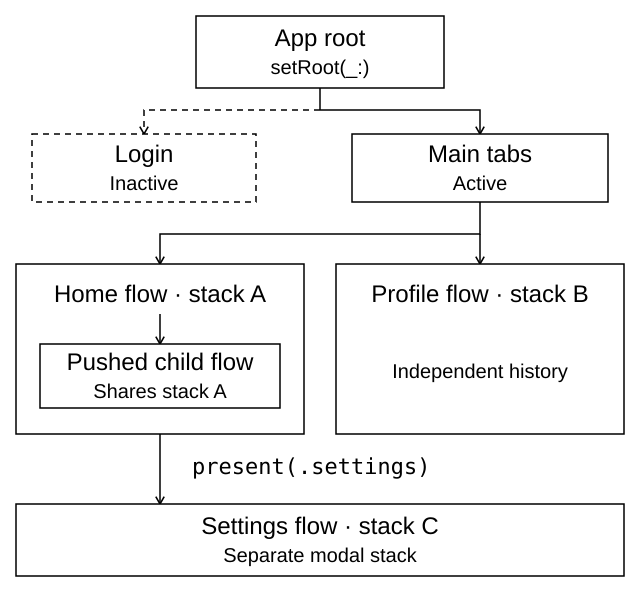
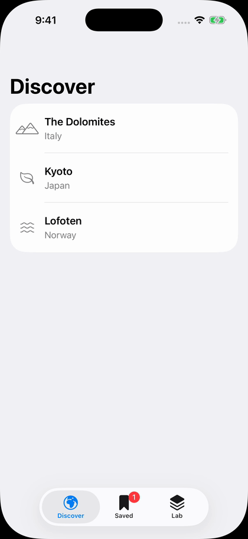
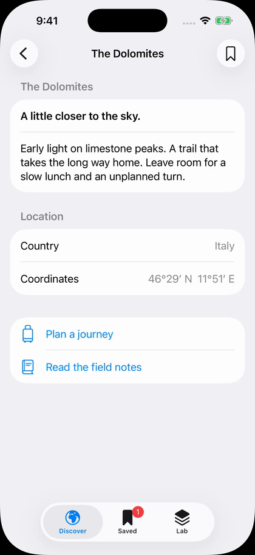

<div align="center">

# Scaffolding 目

**SwiftUI navigation owned by coordinators. Composable across modules.**

[](https://swift.org)
[](https://developer.apple.com/ios/)
[](https://developer.apple.com/macos/)
[](https://swift.org/package-manager/)

[Get started](https://dotaeva.github.io/scaffolding/documentation/scaffolding/meetscaffolding) ·
[Essentials](https://dotaeva.github.io/scaffolding/documentation/scaffolding/essentials) ·
[Example app](Example/Atlas/README.md)

</div>

Scaffolding moves navigation state into observable coordinator classes. Views
call actions; feature modules expose coordinators; a parent composes them into
an app. SwiftUI still renders the stacks, tabs, sheets, and split views.

## Routes are functions

The `@Scaffoldable` macro generates a typed `Destinations` enum from the
coordinator's route functions:

```swift
import SwiftUI
import Scaffolding

@MainActor @Observable @Scaffoldable
final class HomeCoordinator: @MainActor FlowCoordinatable {
    var stack = FlowStack<HomeCoordinator>(root: .home)

    func home() -> some View { HomeView() }
    func detail(id: Int) -> some View { DetailView(id: id) }
    func settings() -> any Coordinatable { SettingsCoordinator() }
}
```

Views read `@Environment(HomeCoordinator.self)` and call the coordinator:

```swift
coordinator.route(to: .detail(id: 42))   // push a screen
coordinator.present(.settings)         // present a child flow as a sheet
coordinator.pop()                      // go back in the flow
```

Mount the app's coordinator with `@State` and `coordinator.view`.
[Your first flow](https://dotaeva.github.io/scaffolding/documentation/scaffolding/meetscaffolding)
is a complete, runnable example, including the views and app entry point.

## Compose features, keep their state separate

<picture>
  <source media="(prefers-color-scheme: dark)" srcset="Sources/Scaffolding/Scaffolding.docc/Resources/coordinator-ownership~dark.svg">
  
</picture>

| App structure | Coordinator | Common action |
|---|---|---|
| Push/pop flow | `FlowCoordinatable` | `route(to: .detail(id: 42))` |
| Independent tabs | `TabCoordinatable` | `selectFirstTab(.home)` |
| Authentication or onboarding boundary | `RootCoordinatable` | `setRoot(.authenticated)` |
| Sidebar, optional content, and detail | `SplitCoordinatable` | `setDetail(.item(id: 42))` |

A pushed child flow joins the host navigation stack. A modal flow gets a
separate stack; flows in tabs or split columns also get their own stacks.
**Do not add a `NavigationStack` inside a flow's route view or `customize(_:)`.**
Return a child coordinator when a feature needs its own navigation logic.

For one result, await the destination's dismissal:

```swift
let item = await coordinator.present(.picker, awaiting: Item.self)
// In the child: dismissCoordinator(returning: item)
```

Use `expecting:` for immediate typed child access, or combine it with `awaiting:`
when both are needed. See [modals and results](https://dotaeva.github.io/scaffolding/documentation/scaffolding/modalsandresults)
for cancellation, result types, and queued presentations.

## Install

Add this package URL in Xcode's **Add Package Dependencies** dialog:

```text
https://github.com/dotaeva/scaffolding.git
```

| Product | Add to |
|---|---|
| **Scaffolding** | App and feature targets |
| **ScaffoldingTesting** | Test targets only; imports Swift Testing |

**Toolchain:** Swift 6.2+ / Xcode 26+. **Platforms:** iOS 18+, macOS 15+,
macCatalyst 18+, tvOS 18+, watchOS 11+.

## Find the right guide

| I want to… | Read |
|---|---|
| Build a first flow | [Getting started](https://dotaeva.github.io/scaffolding/documentation/scaffolding/meetscaffolding) |
| Learn the model and the rules | [Essentials](https://dotaeva.github.io/scaffolding/documentation/scaffolding/essentials) |
| Understand the macro and route signatures | [Defining routes](https://dotaeva.github.io/scaffolding/documentation/scaffolding/definingroutes) |
| Push, pop, and host child flows | [Building flows](https://dotaeva.github.io/scaffolding/documentation/scaffolding/flows) |
| Split features into packages, or keep one target | [Modular apps](https://dotaeva.github.io/scaffolding/documentation/scaffolding/modularapps) · [Monolithic apps](https://dotaeva.github.io/scaffolding/documentation/scaffolding/monolithicapps) |
| Present, dismiss, or return a value | [Modals and results](https://dotaeva.github.io/scaffolding/documentation/scaffolding/modalsandresults) |
| Structure an app | [Root switching](https://dotaeva.github.io/scaffolding/documentation/scaffolding/rootswitching) · [Tabs](https://dotaeva.github.io/scaffolding/documentation/scaffolding/tabbars) · [Split views](https://dotaeva.github.io/scaffolding/documentation/scaffolding/splitviews) |
| Open a URL or find the owning coordinator | [Deep linking](https://dotaeva.github.io/scaffolding/documentation/scaffolding/deeplinking) · [Orientation](https://dotaeva.github.io/scaffolding/documentation/scaffolding/orientation) |
| Restore or test navigation | [State restoration](https://dotaeva.github.io/scaffolding/documentation/scaffolding/staterestoration) · [Testing](https://dotaeva.github.io/scaffolding/documentation/scaffolding/testingcoordinators) |
| Move existing code over | [Native SwiftUI](https://dotaeva.github.io/scaffolding/documentation/scaffolding/nativecomparison) · [Stinsen](https://dotaeva.github.io/scaffolding/documentation/scaffolding/migratingfromstinsen) |

The [DocC catalog](Sources/Scaffolding/Scaffolding.docc) includes the guides
and generated API reference. Deprecated calls still compile, and each warning
names its replacement.
Existing `route`, `present`, and other coordinator-method callers need no storage
migration; container state remains readable and is changed through those methods.

## Explore an app

**[Atlas](Example/Atlas/README.md)** is the modular example: ten Swift packages,
public feature coordinators, internal screens, and a Planner that returns a
typed result. iPhone uses tabs; iPad and Mac use a split view. The same features
work in both layouts.

<p align="center">
  <picture>
    <source media="(prefers-reduced-motion: reduce)" srcset="Sources/Scaffolding/Scaffolding.docc/Resources/atlas-tab-history-poster.png">
    
  </picture>
  <picture>
    <source media="(prefers-reduced-motion: reduce)" srcset="Sources/Scaffolding/Scaffolding.docc/Resources/atlas-planner-result-poster.png">
    
  </picture>
</p>

**Tab history stays put. Planner returns a result.** Real iPhone 17 simulator
recordings on iOS 26.4, at original speed (16 and 18 seconds).
Watch them with pause/replay controls in [Tab bars](https://dotaeva.github.io/scaffolding/documentation/scaffolding/tabbars) and
[Modals and results](https://dotaeva.github.io/scaffolding/documentation/scaffolding/modalsandresults),
or see the [capture steps and still images](Example/Atlas/Recordings/README.md).

```sh
open Example/Atlas/Atlas.xcodeproj
```

| Example | Best for |
|---|---|
| [Atlas](Example/Atlas/README.md) | Module boundaries, typed results, deep links, and per-window checkpoints |
| [Checklist](Example/Checklist) | A native task app with tabs, split columns, and a navigation playground |
| [Stinsen Parity](Example/StinsenParity) | Comparing the same login, tabs, and todo flows across the two libraries |

## Coding-agent guides

[AGENTS.md](AGENTS.md) explains the ownership rules and common patterns.
Five focused [skills](skills) cover coordinator definitions, routing,
environment values, restoration, and testing. This repository also provides a
Claude Code plugin marketplace:

```sh
claude plugin marketplace add dotaeva/scaffolding
claude plugin install scaffolding@scaffolding
```

## Build and validate

```sh
swift test
swift test --package-path Example/Atlas/Packages/AtlasIntegrationTests
```

`swift test` covers runtime behavior, macro expansion and diagnostics, and macOS
hosted regressions. The second command tests the modular Atlas example.

[MIT license](LICENSE).
